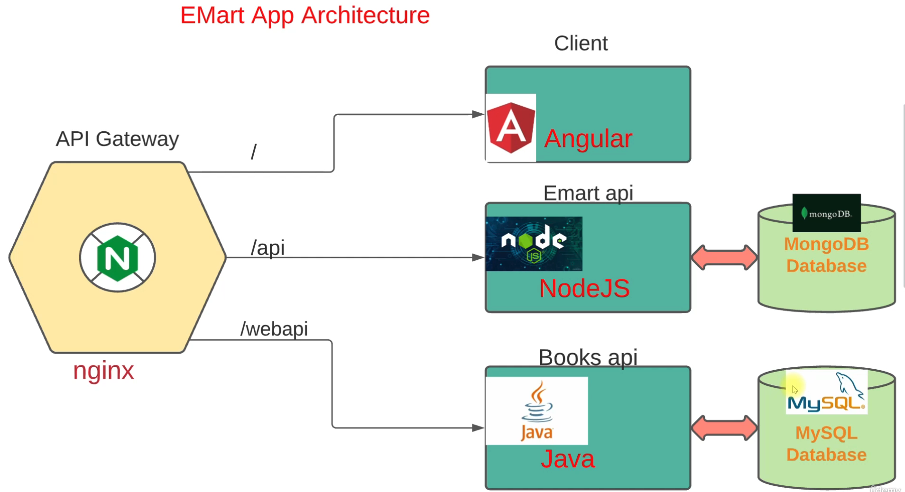
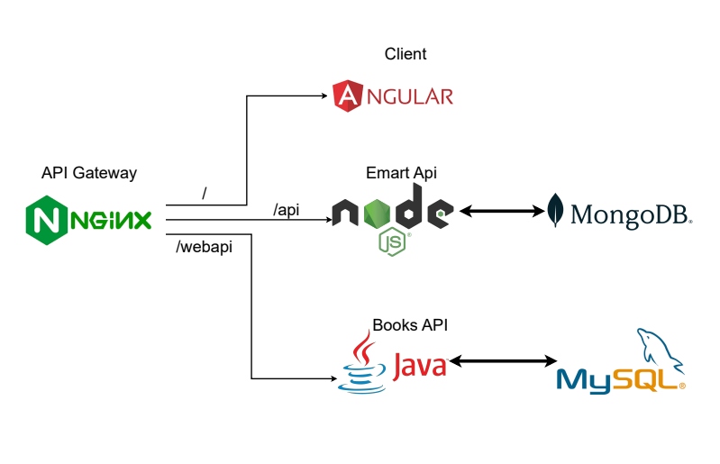

# 🚀 Emart DevOps Platform


A production-style **end-to-end DevOps implementation** of a microservices-based e-commerce application deployed on Kubernetes (k3s) using **GitOps, CI/CD, observability, and security best practices**.

---

## 🧠 Project Overview

This project demonstrates how a modern DevOps workflow is implemented:

* Microservices architecture (Node.js + Java + Angular)
* Containerization with Docker
* CI pipeline using GitHub Actions
* GitOps-based CD using ArgoCD
* Kubernetes (k3s) cluster deployment
* Observability using Prometheus & Grafana
* Security scanning using Trivy

---

## 🏗️ Architecture



Additional breakdown:



---

## ⚙️ Tech Stack

| Category         | Tools               |
| ---------------- | ------------------- |
| Containerization | Docker              |
| Orchestration    | k3s (Kubernetes)    |
| CI               | GitHub Actions      |
| CD               | ArgoCD (GitOps)     |
| Monitoring       | Prometheus, Grafana |
| Security         | Trivy               |
| Ingress          | Traefik             |
| Cloud            | AWS EC2             |

---

## 📁 Repository Structure

```
.
├── app/                    # Application source code
│   ├── client/             # Angular frontend
│   ├── node-api/           # Node.js backend
│   └── java-api/           # Spring Boot backend
│
├── k8s/                    # Kubernetes base + overlays (optional use)
├── helm/                   # Helm chart (optional advanced deployment)
├── architecture-diagram/   # System design diagrams
├── docs/                   # Documentation
├── env/                    # Environment templates
├── .github/workflows/      # CI pipelines
├── Makefile                # Dev automation
└── README.md
```

---

## 🔄 CI Pipeline (GitHub Actions)

### Workflow

1. Code push triggers pipeline
2. Docker images built for:

   * frontend
   * node-api
   * java-api
3. Images scanned using Trivy
4. Images pushed to Docker Hub
5. GitOps repo updated with new image tags

---

## 🐳 Docker Images

Published to Docker Hub:

```
<dockerhub-username>/emart-frontend
<dockerhub-username>/emart-node-api
<dockerhub-username>/emart-java-api
```

Tagging strategy:

* `latest`
* `<commit-sha>`

---

## 🔐 Security

* Image scanning using Trivy
* Non-root containers
* `.trivyignore` for noise reduction
* Secrets externalized (not hardcoded)

---

## ☸️ Kubernetes Deployment

Deployment is handled via **GitOps repo**:

👉 See: `emart-gitops`

This repo does NOT directly deploy to cluster.
Instead:

```
CI → DockerHub → GitOps Repo → ArgoCD → Kubernetes
```

---

## 🌐 Application Access

| Service    | URL                              |
| --------   | -------------------------------- |
| Frontend   | https://yourdomain.com           |
| Node API   | https://yourdomain.com/api       |
| Java API   | https://yourdomain.com/webapi    |
| Grafana    | https://grafana.yourdomain.com   |
| Prometheus | https://prometheus.yourdomain.com|

---

## 📊 Observability

* Prometheus for metrics collection
* Grafana dashboards:

  * Cluster health
  * Node metrics
  * Pod metrics

---

## 🧪 Local Development (Optional)

```bash
cd app
docker-compose up
```

---

## 🚀 Key DevOps Highlights

* Fully automated CI/CD pipeline
* GitOps-based deployment model
* Multi-service container architecture
* Production-like Kubernetes setup using k3s
* Integrated monitoring & alerting
* Secure container practices

---

## 📸 Screenshots

Screenshots available under:

```
docs/screenshots/
```

Includes:

* CI pipeline
* Kubernetes cluster
* ArgoCD sync
* Grafana dashboards
* Application UI

---

## 📌 Future Enhancements

* HPA (Horizontal Pod Autoscaler)
* Secrets via Vault / External Secrets
* Blue-Green / Canary deployments
* Advanced alerting (Slack/email)

---

## 📜 License

MIT License
